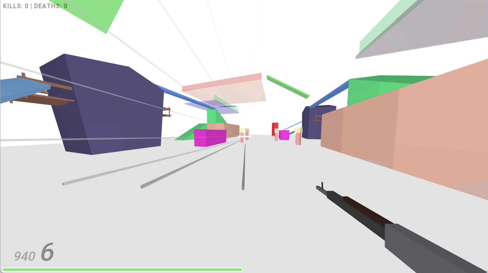
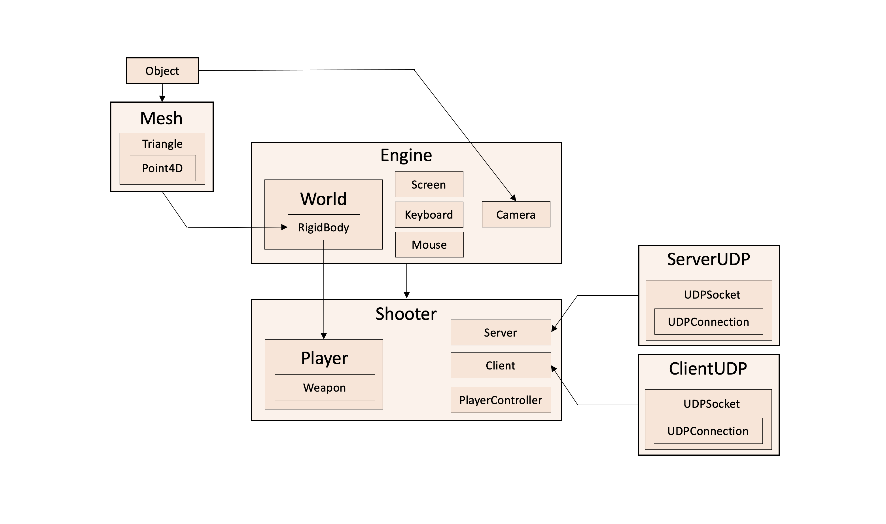
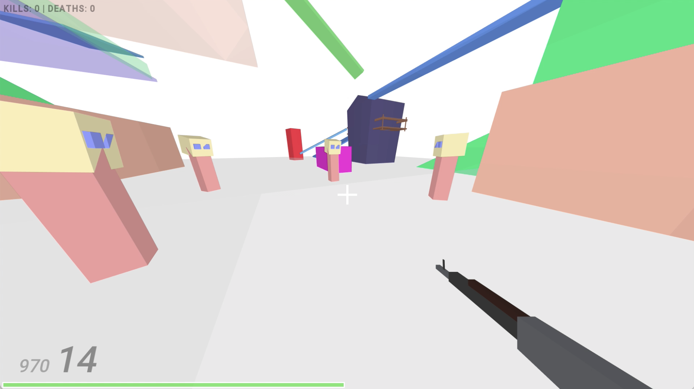
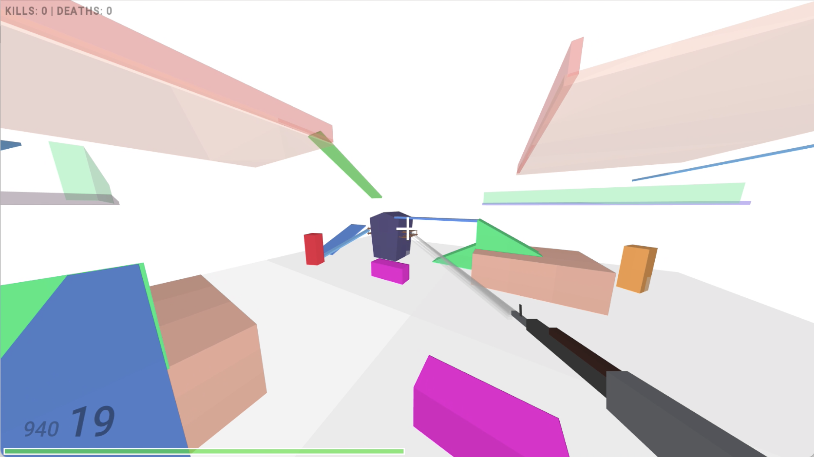
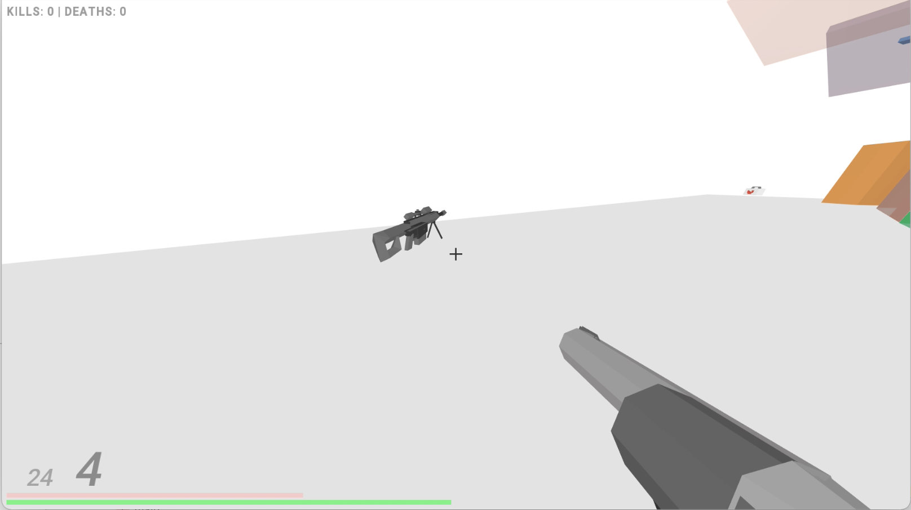
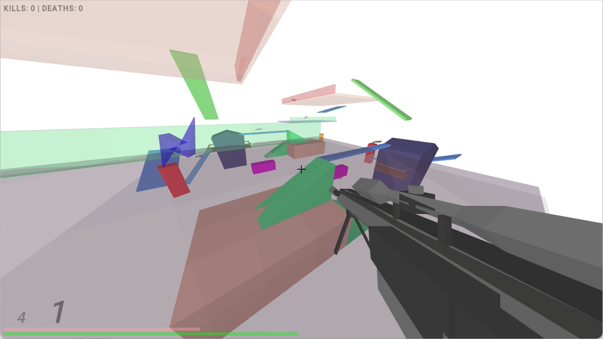
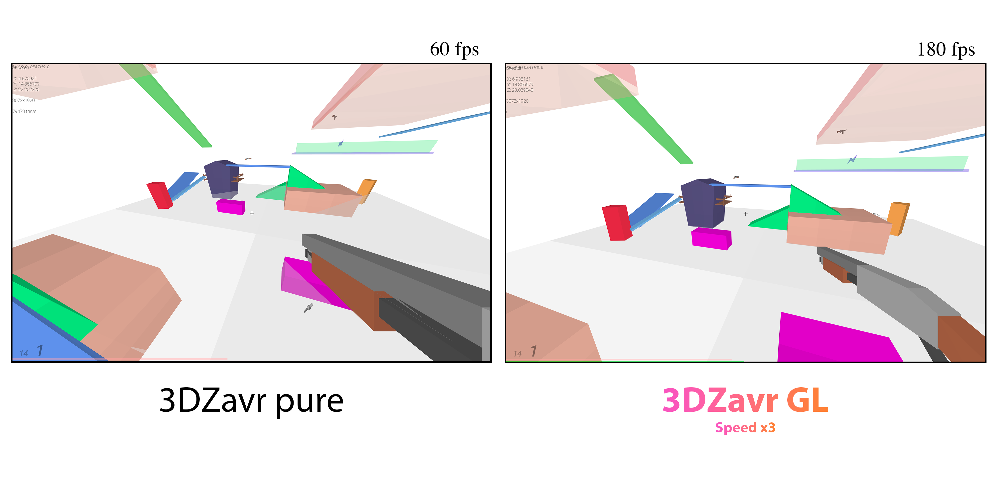

# Shooter on self-written 3D engine

<h4>About:</h4>

Source code of simple shooter on [3Dzavr game engine](https://github.com/vectozavr/3dzavr)

<h4>Installation (OS Windows):</h4>
1) [Download shooter.7z](https://drive.google.com/file/d/10mhgxUXd0e482U4oMaq4RD1rDeu3-YAX/view?usp=sharing), [unzip it](https://www.7-zip.org) and run shooter.exe

2) Write <b>ip</b> and <b>port</b> of server in <b>bin/connect.txt</b> file.

3) Write <b>port</b> of the server in <b>bin/server.txt</b> file (only for computer where the server will be running).

3) Enjoy gaming!

<h4>Control:</h4>

<b>SHIFT</b> - slow motion (this ability is not infinite: its bar is next to hp)

<b>E & Q </b> or keys <b> <- -> </b> - change weapon

<b>R</b> - recharge

Player control is standard.

<h4>Playing with a source code:</h4>

Structure:

1) [Download and install OpenAL library](https://openal.org/downloads/) for SFML sound support (in current version you can't setup this engine without OpenAL)

2) Clone this repository

3) Open project
   
   Using [CLion](https://www.jetbrains.com/clion/) with [MinGW (32-bit)](https://sourceforge.net/projects/mingw-w64/files/Toolchains%20targetting%20Win32/Personal%20Builds/mingw-builds/7.3.0/threads-posix/dwarf/i686-7.3.0-release-posix-dwarf-rt_v5-rev0.7z/download) or [MinGW (64-bit)](https://sourceforge.net/projects/mingw-w64/files/Toolchains%20targetting%20Win64/Personal%20Builds/mingw-builds/7.3.0/threads-posix/seh/x86_64-7.3.0-release-posix-seh-rt_v5-rev0.7z/download) compiler: open CMakeList.txt as a project

   Using [Visual Studio](https://visualstudio.microsoft.com/ru/): open shooter.sln as a project

4) Built project and run the game

P/S: SFML for 32-bit Windows already included into this repository. So, you don't need to manually install it to your computer. If you have any issues with SFML, you can try to [download another version or build SFML by yourself.](https://www.sfml-dev.org/download.php) 

Demos:

Online:

GamePlay:

